# AI System Design Mastery: Agentic Architectures & RAG

---

# PART I: AGENTIC ARCHITECTURES (Systemic & Conceptual)

## Chapter 1: Foundational Architectural Paradigms `[Beginner→Intermediate]`

### Reactive Architectures

**In plain English:** A reactive agent has no memory and no model of the world — it's a lookup table from stimulus to response. Input comes in, a rule fires, an action comes out. Think of a thermostat, or a simple chatbot intent-router.

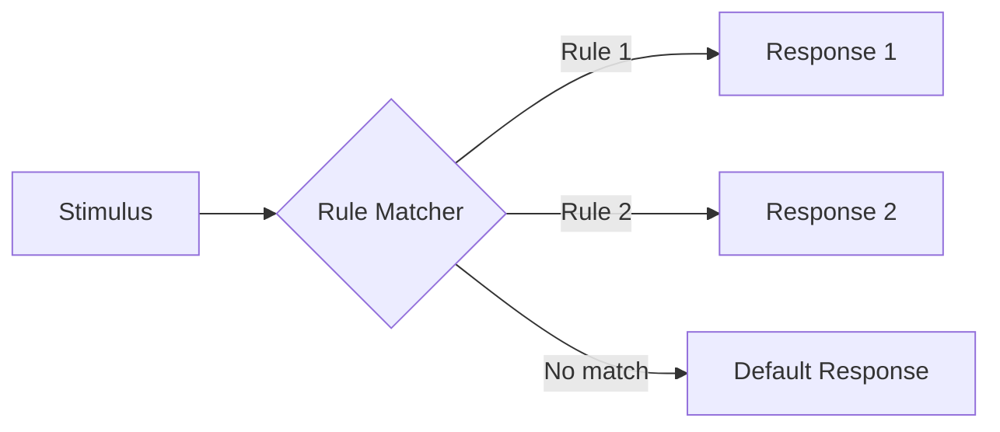

**When to use vs. avoid:** Use for low-latency, high-throughput tasks with a small, well-defined action space (routing, moderation triage). Avoid when the task requires multi-step planning or remembering prior turns — reactive agents cannot reason about consequences.

### Deliberative Architectures

**In plain English:** A deliberative agent builds an internal model of the world, generates a plan (a sequence of actions) *before* acting, and only then executes. Classical AI planning (STRIPS) formalizes this: states are sets of predicates, actions have preconditions and effects, and planning is search through state-space.

STRIPS action schema:
```
Action: MoveFile(file, src, dest)
Precondition: At(file, src) ∧ ¬Locked(file)
Effect: At(file, dest) ∧ ¬At(file, src)
```

**When to use vs. avoid:** Use when actions are expensive/irreversible and you need correctness guarantees before execution (financial transactions, infrastructure changes). Avoid in dynamic environments where the world changes faster than you can plan — the plan goes stale.

### Hybrid (BDI — Belief-Desire-Intention)

**In plain English:** BDI is the dominant enterprise pattern because it balances reactivity and deliberation. **Beliefs** are the agent's current model of the world (facts, retrieved data). **Desires** are goals it wants achieved (possibly conflicting, not all pursued at once). **Intentions** are the subset of desires the agent has committed to and is actively executing via a plan.

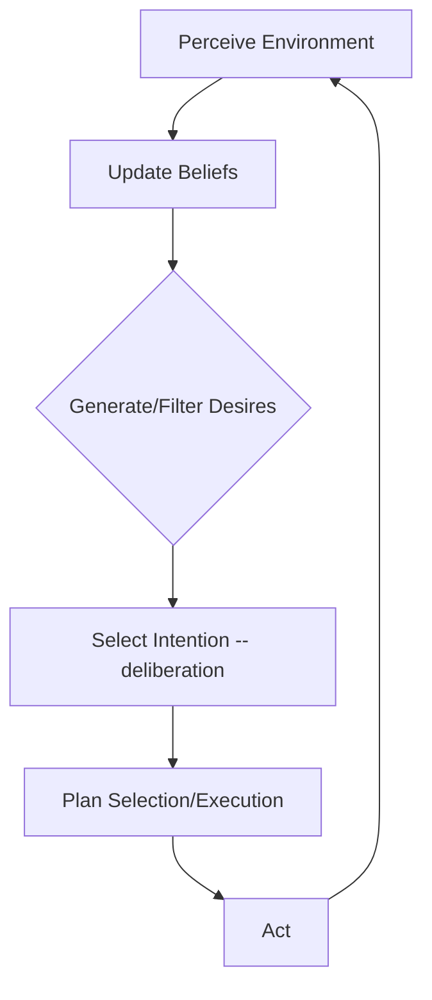

### Code Example: A Minimal BDI Reasoning Loop

```python
from dataclasses import dataclass, field
from typing import Callable

@dataclass
class Belief:
    key: str
    value: object

@dataclass
class Desire:
    name: str
    priority: int
    is_satisfied: Callable[[dict], bool]

@dataclass
class Plan:
    goal_name: str
    steps: list  # list of callables: (beliefs) -> belief_updates dict

class BDIAgent:
    def __init__(self):
        self.beliefs: dict = {}
        self.desires: list[Desire] = []
        self.plan_library: dict[str, Plan] = {}
        self.intention: Desire | None = None
        self.intention_plan: Plan | None = None
        self.step_index: int = 0

    def perceive(self, new_facts: dict):
        # Belief revision: merge new percepts into the belief base
        self.beliefs.update(new_facts)

    def deliberate(self):
        # Filter desires already satisfied, then commit to the highest-priority remainder
        active = [d for d in self.desires if not d.is_satisfied(self.beliefs)]
        if not active:
            self.intention = None
            return
        chosen = max(active, key=lambda d: d.priority)
        if self.intention is None or self.intention.name != chosen.name:
            # Re-commit: adopt a new intention and reset its plan
            self.intention = chosen
            self.intention_plan = self.plan_library[chosen.name]
            self.step_index = 0

    def act(self):
        if self.intention is None:
            return  # nothing to do this cycle
        if self.step_index >= len(self.intention_plan.steps):
            return  # plan exhausted; deliberate() will drop this intention next cycle
        step = self.intention_plan.steps[self.step_index]
        updates = step(self.beliefs)  # <-- execute one plan step
        self.beliefs.update(updates)
        self.step_index += 1

    def cycle(self, percepts: dict):
        self.perceive(percepts)
        self.deliberate()
        self.act()


# --- Example wiring ---
agent = BDIAgent()
agent.desires = [
    Desire("deploy_service", priority=5,
           is_satisfied=lambda b: b.get("deployed") is True),
]
agent.plan_library["deploy_service"] = Plan(
    goal_name="deploy_service",
    steps=[
        lambda b: {"build_ok": True},
        lambda b: {"tests_ok": True},
        lambda b: {"deployed": True},
    ],
)

for _ in range(4):
    agent.cycle({})
    print(agent.beliefs, "| intention:", agent.intention.name if agent.intention else None)
```

*⚠️ Pitfall: A naive `deliberate()` that re-evaluates priority every cycle can thrash — abandoning an in-progress intention because a slightly higher-priority desire briefly appears. Add commitment inertia (only switch if the new desire beats the current one by a margin, or the current plan has failed).*

---

## Chapter 2: Hierarchical & Distributed Agentic Structures `[Intermediate]`

### Supervisor (Hierarchical)

A top-level manager decomposes an incoming task, delegates subtasks to specialized workers, and synthesizes their outputs. Centralized control means predictable routing and easy debugging, at the cost of a single point of bottleneck/failure.

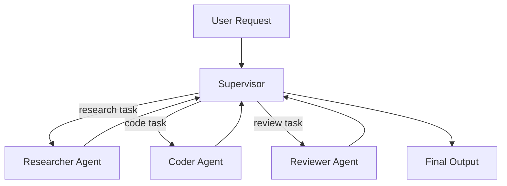

### Swarm / Peer-to-Peer

Agents broadcast/receive messages in a shared channel (e.g., AutoGen `GroupChat`) with no central router — the *next speaker* is decided dynamically (round-robin, LLM-selected, or voting). More resilient to a single agent's failure, but coordination overhead and emergent deadlocks are real risks.

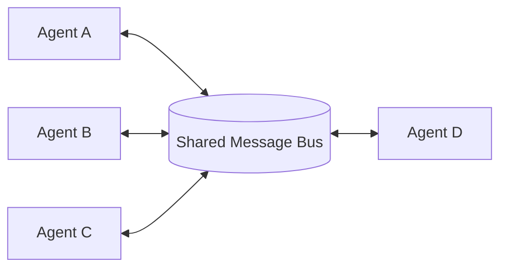

### Subsumption Architecture

Layered control where lower layers (reflexes: "stop if blocked") always have the ability to override higher layers (deliberative planning), never the reverse. Originally Brooks' robotics architecture; in LLM agent systems this maps to safety layers that can hard-veto a planned tool call regardless of what the reasoning layer decided.

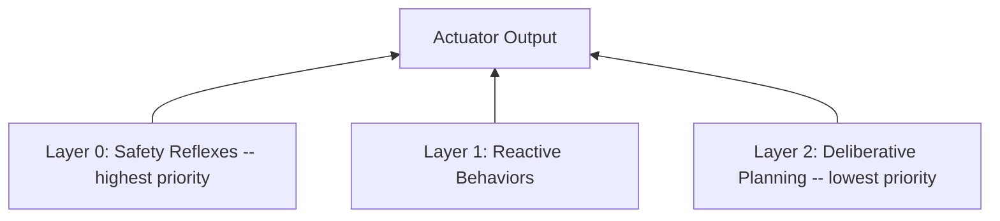

**When to use vs. avoid:** Supervisor for well-decomposable tasks with clear specialist boundaries (most enterprise workflows). Swarm for open-ended brainstorming/debate tasks where no single agent should dominate control. Subsumption specifically for safety-critical layering, rarely as your *entire* architecture.

### Code Example: Supervisor via `langgraph` (Conceptual) vs. Raw `asyncio` Queues

```python
# --- Conceptual LangGraph Supervisor (see Part 4/5 of the LangGraph guide for full detail) ---
# builder.add_node("supervisor", supervisor_fn)
# builder.add_node("researcher", researcher_subgraph)
# builder.add_conditional_edges("supervisor", route_fn, {...})
# graph = builder.compile()

# --- Raw asyncio queue-based swarm, no framework ---
import asyncio
import random

class Message:
    def __init__(self, sender: str, content: str):
        self.sender = sender
        self.content = content

async def agent_worker(name: str, inbox: asyncio.Queue, bus: asyncio.Queue, turns: int):
    for _ in range(turns):
        msg: Message = await inbox.get()
        # Simulate an LLM call deciding a response
        await asyncio.sleep(random.uniform(0.01, 0.05))
        reply = Message(name, f"{name} responds to: {msg.content}")
        await bus.put(reply)

async def dispatcher(bus: asyncio.Queue, inboxes: dict[str, asyncio.Queue], rounds: int):
    for _ in range(rounds):
        msg: Message = await bus.get()
        # Broadcast to every agent except the sender (swarm-style fanout)
        for name, inbox in inboxes.items():
            if name != msg.sender:
                await inbox.put(msg)

async def run_swarm():
    names = ["researcher", "coder", "reviewer"]
    inboxes = {n: asyncio.Queue() for n in names}
    bus = asyncio.Queue()

    await inboxes["researcher"].put(Message("user", "find the LangGraph release notes"))

    workers = [agent_worker(n, inboxes[n], bus, turns=2) for n in names]
    disp = dispatcher(bus, inboxes, rounds=4)

    await asyncio.gather(*workers, disp)

asyncio.run(run_swarm())
```

*⚠️ Pitfall: Broadcast fanout in a swarm grows O(n²) in message volume as agents scale — past ~5-6 agents, switch to a supervisor or a shared blackboard (single mutable state store) instead of pairwise broadcast.*

---

## Chapter 3: State Management & Persistence at Scale `[Intermediate→Expert]`

### Episodic vs. Semantic vs. Procedural Memory

| Memory Type | Human Analogy | Typical Store | Example |
|---|---|---|---|
| Episodic | "What happened when" | Vector DB (timestamped embeddings) | "User asked about refunds on March 3" |
| Semantic | General facts/relationships | Graph DB (Neo4j) or knowledge base | "User works at Acme Corp, reports to Priya" |
| Procedural | "How to do things" | Code / tool definitions / cached plans | A saved successful plan for "deploy to staging" |

### Event Sourcing & CQRS

**In plain English:** Instead of storing the agent's *current* state and overwriting it, store every state *change* as an immutable, append-only event. Current state is then a fold/reduce over the event log. This gives you free audit trails and "time travel" (replay events up to point N to reconstruct any past state). CQRS (Command Query Responsibility Segregation) separates the write model (append events) from the read model (a materialized, queryable projection), so reads stay fast even as the event log grows.

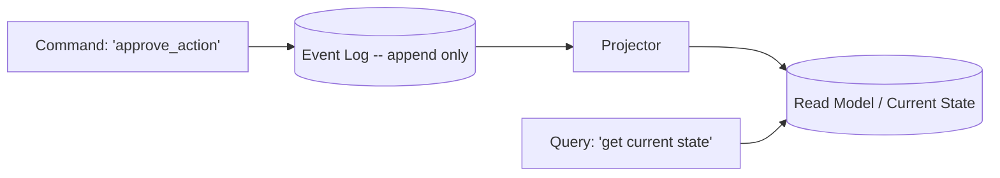

### Checkpointing Strategies

| Strategy | Mechanism | Recovery Speed | Storage Cost |
|---|---|---|---|
| Full Snapshot | Serialize entire state at interval N | Fast (single load) | High (redundant data) |
| Incremental / WAL | Log only deltas since last snapshot | Slower (replay deltas) | Low |
| Hybrid | Periodic snapshot + WAL since last snapshot | Balanced | Balanced |

### Code Example: PostgreSQL Schema for Agent State Versioning

```sql
-- Event-sourced agent state: append-only log + materialized snapshot table

CREATE TABLE agent_events (
    event_id      BIGSERIAL PRIMARY KEY,
    thread_id     UUID NOT NULL,
    event_type    TEXT NOT NULL,             -- e.g. 'belief_updated', 'action_taken'
    payload       JSONB NOT NULL,
    created_at    TIMESTAMPTZ NOT NULL DEFAULT now(),
    sequence_num  BIGINT NOT NULL             -- monotonic per thread_id, for ordered replay
);

CREATE INDEX idx_events_thread_seq ON agent_events (thread_id, sequence_num);

-- Periodic full snapshot to bound replay time (hybrid checkpointing)
CREATE TABLE agent_snapshots (
    thread_id       UUID NOT NULL,
    sequence_num    BIGINT NOT NULL,          -- snapshot taken AFTER this event sequence
    state           JSONB NOT NULL,
    created_at      TIMESTAMPTZ NOT NULL DEFAULT now(),
    PRIMARY KEY (thread_id, sequence_num)
);

-- Reconstruction query: latest snapshot + events since
-- 1. SELECT state, sequence_num FROM agent_snapshots
--    WHERE thread_id = $1 ORDER BY sequence_num DESC LIMIT 1;
-- 2. SELECT payload FROM agent_events
--    WHERE thread_id = $1 AND sequence_num > $snapshot_seq
--    ORDER BY sequence_num ASC;
-- 3. Fold step 2's events onto step 1's state in application code.
```

*⚠️ Pitfall: Forgetting the `sequence_num` uniqueness-per-thread constraint lets concurrent writers interleave events out of order, silently corrupting replay. Enforce it with a `UNIQUE(thread_id, sequence_num)` constraint and a transaction that reads-max-then-inserts.*

---

## Chapter 4: Agent Orchestration & Human-in-the-Loop (HITL) `[Intermediate]`

### Breaking the Autonomy

Pause for human approval when an action is **irreversible** (delete data, send money, send external comms), **high-blast-radius** (infra changes, mass emails), or when the agent's own confidence/consistency check fails.

### Handoff Protocols

A handoff must transfer: (1) full conversation/task context, (2) the reason for the handoff, (3) what's already been tried. Silent handoffs — dropping a user into a new agent with no context — are the single biggest UX failure in multi-agent systems.

### Escalation Policies

Every HITL pause needs a timeout and a defined fallback (auto-approve low-risk, auto-reject and notify for high-risk, or queue-and-page a human) — an agent that waits forever for approval is a stuck resource.

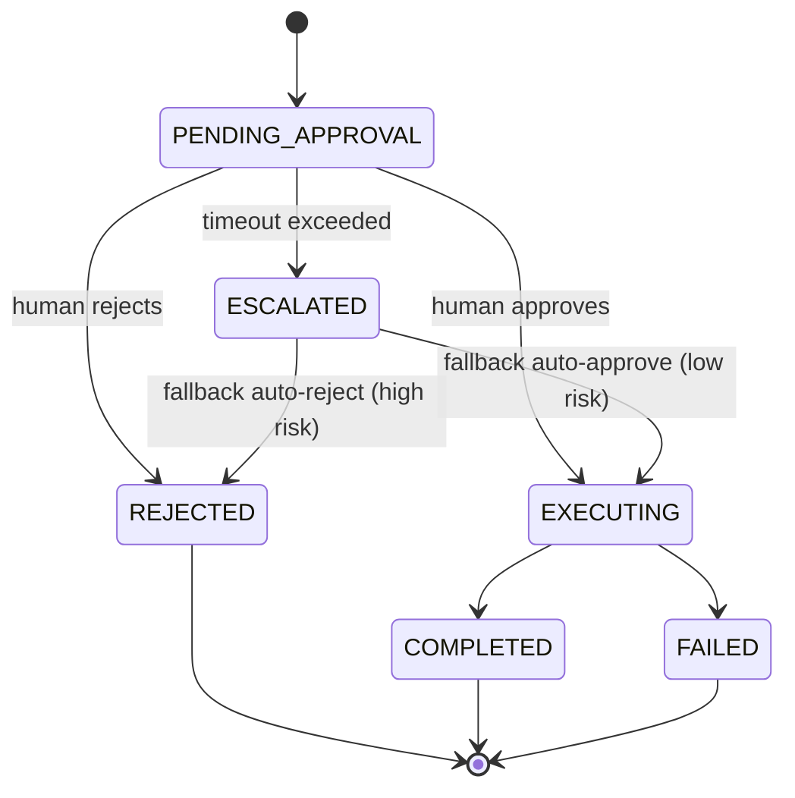

### Code Example: PENDING_APPROVAL → EXECUTING → REJECTED State Machine

```python
import time
from enum import Enum, auto
from dataclasses import dataclass, field

class ActionState(Enum):
    PENDING_APPROVAL = auto()
    EXECUTING = auto()
    REJECTED = auto()
    ESCALATED = auto()
    COMPLETED = auto()
    FAILED = auto()

@dataclass
class GuardedAction:
    action_name: str
    risk_level: str  # "low" | "high"
    created_at: float = field(default_factory=time.time)
    state: ActionState = ActionState.PENDING_APPROVAL
    timeout_seconds: float = 30.0

    def check_timeout(self):
        if self.state == ActionState.PENDING_APPROVAL and \
           (time.time() - self.created_at) > self.timeout_seconds:
            self.state = ActionState.ESCALATED
            self._apply_fallback_policy()

    def _apply_fallback_policy(self):
        # Escalation policy: auto-approve low risk, auto-reject high risk
        if self.risk_level == "low":
            self.state = ActionState.EXECUTING
        else:
            self.state = ActionState.REJECTED

    def approve(self):
        if self.state != ActionState.PENDING_APPROVAL:
            raise ValueError(f"Cannot approve action in state {self.state}")
        self.state = ActionState.EXECUTING

    def reject(self):
        if self.state != ActionState.PENDING_APPROVAL:
            raise ValueError(f"Cannot reject action in state {self.state}")
        self.state = ActionState.REJECTED

    def execute(self, fn):
        if self.state != ActionState.EXECUTING:
            raise ValueError(f"Cannot execute action in state {self.state}")
        try:
            fn()
            self.state = ActionState.COMPLETED
        except Exception:
            self.state = ActionState.FAILED
            raise


# --- Usage ---
action = GuardedAction(action_name="send_mass_email", risk_level="high", timeout_seconds=5)
print(action.state)          # PENDING_APPROVAL
action.reject()
print(action.state)          # REJECTED

low_risk = GuardedAction(action_name="format_report", risk_level="low", timeout_seconds=0.1)
time.sleep(0.2)
low_risk.check_timeout()     # times out -> auto-approved (low risk)
print(low_risk.state)        # EXECUTING
low_risk.execute(lambda: print("report formatted"))
print(low_risk.state)        # COMPLETED
```

*⚠️ Pitfall: Escalation fallbacks that "auto-approve on timeout" for anything above low risk turn HITL into theater — an attacker (or a bug) can force approval simply by making the human-notification channel slow or unavailable.*

---

## Chapter 5: Safety, Guardrails & Constraint Programming `[Expert]`

### Semantic Constraints

An LLM (often a smaller/cheaper one) validates another LLM's output *before* it's allowed to trigger a side effect — checking for policy violations, PII leakage, or off-topic drift.

### Operational Constraints

Hard, non-LLM-checked limits: max tool calls per session, dollar budget caps, max recursion depth, rate limits per user. These must be enforced in code, never delegated to the model's judgment.

### Formal Verification

For domains where correctness is critical (financial workflows, infra changes), check a proposed plan against a formal rule set *before* execution — e.g., "no action may reduce `available_balance` below `minimum_reserve`" — using a constraint solver or simple precondition checker, not an LLM's self-assessment.

### Code Example: Guardrail Middleware Intercepting Tool Calls

```python
from dataclasses import dataclass
from typing import Callable

class GuardrailViolation(Exception):
    pass

@dataclass
class ToolCallBudget:
    max_calls_per_session: int
    max_cost_usd: float
    calls_made: int = 0
    cost_spent: float = 0.0

FORBIDDEN_COMMANDS = {"rm -rf", "DROP TABLE", "DELETE FROM users", "sudo"}

def guardrail_middleware(
    tool_name: str,
    tool_args: dict,
    budget: ToolCallBudget,
    estimated_cost: float,
    next_fn: Callable,
):
    # 1. Operational constraint: hard budget caps, enforced in code
    if budget.calls_made >= budget.max_calls_per_session:
        raise GuardrailViolation(f"Max tool calls ({budget.max_calls_per_session}) exceeded")
    if budget.cost_spent + estimated_cost > budget.max_cost_usd:
        raise GuardrailViolation(f"Budget cap ${budget.max_cost_usd} would be exceeded")

    # 2. Formal/rule-based constraint: forbidden command substring check
    args_str = str(tool_args)
    for forbidden in FORBIDDEN_COMMANDS:
        if forbidden.lower() in args_str.lower():
            raise GuardrailViolation(f"Tool call blocked: contains forbidden pattern '{forbidden}'")

    # 3. Domain-specific formal check example: balance never goes negative
    if tool_name == "transfer_funds":
        if tool_args.get("amount", 0) > tool_args.get("available_balance", 0):
            raise GuardrailViolation("Transfer would exceed available balance")

    # All checks passed -- execute the real tool call
    result = next_fn(**tool_args)
    budget.calls_made += 1
    budget.cost_spent += estimated_cost
    return result


# --- Usage ---
def real_shell_tool(command: str):
    return f"executed: {command}"

budget = ToolCallBudget(max_calls_per_session=10, max_cost_usd=1.00)

try:
    guardrail_middleware(
        "shell", {"command": "rm -rf /data"}, budget, estimated_cost=0.01,
        next_fn=lambda command: real_shell_tool(command),
    )
except GuardrailViolation as e:
    print(f"BLOCKED: {e}")

result = guardrail_middleware(
    "shell", {"command": "ls -la"}, budget, estimated_cost=0.01,
    next_fn=lambda command: real_shell_tool(command),
)
print(result)
```

*⚠️ Pitfall: Substring-based forbidden-command checks are trivially bypassed by an adversarial or confused model (`"r" + "m -rf"`, base64-encoded commands). Substring matching is a floor, not a ceiling — pair it with an allowlist of permitted commands wherever possible, which is far harder to bypass than a denylist.*

---

# PART II: RETRIEVAL-AUGMENTED GENERATION (The Complete Spectrum)

## Chapter 6: Data Ingestion & Pre-processing `[Beginner→Intermediate]`

### Document Parsing

| Format | Key Challenge | Recommended Approach |
|---|---|---|
| PDF | Nested tables, multi-column layout, scanned pages | Layout-aware parsers (e.g., `unstructured`, `pdfplumber`); OCR (Tesseract/cloud OCR) only for scanned pages — OCR accuracy drops sharply on low-res scans and rotated text |
| Markdown/HTML | Preserving heading hierarchy as metadata | Parse into a tree (headers as parent nodes) rather than flattening to plain text |
| Codebases | Chunking mid-function breaks semantic units | AST-aware splitting (chunk at function/class boundaries, not fixed character counts) |

### Metadata Extraction

Metadata (title, date, author, section header, source URL) is what makes **filtered retrieval** possible — e.g., "only search docs from Q3 2026" is a metadata filter applied *before* the vector search narrows the candidate set, which is both faster and more precise than hoping the embedding captures recency.

### Chunking Strategies

**Fixed-size Chunking:** Split every N tokens with an overlap (commonly 10-20% of chunk size) to avoid severing a sentence across chunk boundaries entirely. Simple, fast, but blind to semantic structure.

**Semantic Chunking:** Embed consecutive sentences, compute the cosine distance between neighboring sentence embeddings, and split where the distance exceeds a threshold — i.e., split where the *topic* shifts, not at an arbitrary character count.

**Recursive Chunking:** Try to split on paragraph breaks first; if a resulting chunk still exceeds the size limit, recursively split on sentence boundaries, then clause boundaries. This is the pragmatic default in most production systems (e.g., LangChain's `RecursiveCharacterTextSplitter`).

**Late Chunking:** Instead of chunking *then* embedding each chunk in isolation (losing cross-chunk context), embed the **entire document** through a long-context embedding model first, then mean-pool the token-level embeddings within each chunk's span. Each chunk's vector now carries context from the whole document, not just its own text.

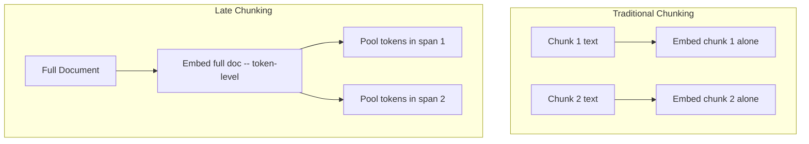

### Code Example: 5 Chunking Strategies Compared

```python
import re
import numpy as np
from typing import List

SAMPLE_TEXT = (
    "LangGraph models agents as cyclic state machines. It replaced DAG-based chains "
    "for reasoning loops. RAG systems retrieve context before generation. Chunking "
    "strategy determines retrieval quality more than almost any other RAG component. "
    "Embedding models map text into a dense vector space for similarity search."
)

# 1. Fixed-size chunking with overlap
def fixed_size_chunk(text: str, chunk_size: int = 80, overlap: int = 16) -> List[str]:
    chunks = []
    start = 0
    while start < len(text):
        end = start + chunk_size
        chunks.append(text[start:end])
        start += chunk_size - overlap  # <-- overlap prevents severing at the boundary
    return chunks

# 2. Recursive chunking: paragraph -> sentence -> clause
def recursive_chunk(text: str, max_len: int = 100) -> List[str]:
    def split_by(seps, s):
        for sep in seps:
            if len(s) <= max_len:
                return [s]
            parts = s.split(sep)
            if len(parts) > 1:
                out = []
                for p in parts:
                    out.extend(split_by(seps[seps.index(sep)+1:], p.strip()) if len(p) > max_len else [p.strip()])
                return [p for p in out if p]
        return [s]
    return split_by(["\n\n", ". ", ", "], text)

# 3. Semantic chunking: split where embedding distance between sentences spikes
def semantic_chunk(text: str, embed_fn, distance_threshold: float = 0.3) -> List[str]:
    sentences = re.split(r'(?<=[.!?]) ', text)
    embeddings = [embed_fn(s) for s in sentences]
    chunks, current = [], [sentences[0]]
    for i in range(1, len(sentences)):
        cos_sim = np.dot(embeddings[i-1], embeddings[i]) / (
            np.linalg.norm(embeddings[i-1]) * np.linalg.norm(embeddings[i]) + 1e-8
        )
        distance = 1 - cos_sim
        if distance > distance_threshold:
            chunks.append(" ".join(current))
            current = [sentences[i]]  # <-- topic shift detected, start new chunk
        else:
            current.append(sentences[i])
    chunks.append(" ".join(current))
    return chunks

# 4. Late chunking: embed whole doc, then mean-pool token spans per chunk
def late_chunk(text: str, token_embed_fn, chunk_boundaries: List[tuple]) -> List[np.ndarray]:
    # token_embed_fn returns (tokens, token_embeddings) for the FULL document
    tokens, token_embeddings = token_embed_fn(text)
    chunk_vectors = []
    for start_tok, end_tok in chunk_boundaries:
        span_embeddings = token_embeddings[start_tok:end_tok]
        chunk_vectors.append(np.mean(span_embeddings, axis=0))  # <-- pooled, context-aware vector
    return chunk_vectors

# 5. AST-aware code chunking (function/class boundaries)
def code_chunk(source: str) -> List[str]:
    import ast
    tree = ast.parse(source)
    chunks = []
    lines = source.splitlines()
    for node in ast.walk(tree):
        if isinstance(node, (ast.FunctionDef, ast.ClassDef)):
            start, end = node.lineno - 1, node.end_lineno
            chunks.append("\n".join(lines[start:end]))
    return chunks

print("Fixed-size:", fixed_size_chunk(SAMPLE_TEXT)[:2])
print("Recursive:", recursive_chunk(SAMPLE_TEXT)[:2])
```

*⚠️ Pitfall: Semantic chunking's threshold is corpus-dependent — a threshold tuned on news articles will over-split or under-split legal contracts. Always calibrate the threshold against a sample of your actual data distribution, not a default from a blog post.*

**When to use vs. avoid:** Fixed-size for homogeneous, low-structure text at scale (cheapest to compute). Recursive as the sane default for mixed document types. Semantic when retrieval precision matters more than ingestion cost (legal, medical). Late chunking when documents have strong cross-paragraph dependencies (long narratives, technical specs with forward references) and you can afford a long-context embedding model.

---

## Chapter 7: Embedding Models & Indexing `[Intermediate→Expert]`

### Dense Retrieval (Bi-Encoders)

**In plain English:** A bi-encoder (BERT, E5, BGE, Cohere Embed) maps a query and a document *independently* into the same vector space, such that semantically similar text lands nearby. Similarity is then just a dot product or cosine similarity — cheap to compute at scale because documents are embedded once, offline, and only the query needs embedding at request time.

Mathematically: given encoder `f`, similarity is `sim(q, d) = f(q) · f(d) / (‖f(q)‖ ‖f(d)‖)`. The model is trained via contrastive loss so that `sim(q, d⁺) ≫ sim(q, d⁻)` for relevant `d⁺` and irrelevant `d⁻`.

### Sparse Retrieval (Lexical)

BM25/TF-IDF score documents by term-frequency statistics — no neural network, no semantic understanding, but *exact* keyword matches (product SKUs, error codes, proper nouns) that dense embeddings sometimes blur past. This is why production hybrid systems never drop lexical search entirely.

### Hybrid Search: Reciprocal Rank Fusion (RRF)

**In plain English:** Run dense and sparse search separately, get two ranked lists, then combine them not by their raw (incomparable) scores but by each document's **rank position** in each list:

```
RRF_score(d) = Σ (1 / (k + rank_i(d)))   for each ranker i, k typically = 60
```

Documents ranked highly by *either* method get boosted; documents that appear in both lists compound their score.

### Indexing Structures

| Structure | Approach | Query Speed | Recall | Notes |
|---|---|---|---|---|
| Flat (brute-force) | Exact nearest-neighbor scan | Slow at scale | 100% (exact) | Fine under ~100K vectors |
| IVFFlat | Cluster vectors into buckets, search nearest buckets | Fast | High (approximate) | Tunable via `nprobe` |
| HNSW | Navigable small-world graph of vectors | Very fast | High (approximate) | Higher memory, best general default |
| DiskANN | Graph index optimized for SSD, not full RAM | Fast | High | Use when index exceeds RAM budget |

All of these solve **MIPS** (Maximum Inner Product Search) approximately — exact nearest-neighbor search is too slow at billions of vectors, so every production index trades a small amount of recall for large speed gains.

### Multi-Vector Retrieval: ColBERT

Instead of pooling a document into one vector, ColBERT keeps a vector **per token** and computes relevance via "late interaction" — for each query token, find its max similarity against any document token, then sum across query tokens. This preserves fine-grained term-level matching that single-vector pooling loses, at higher storage/compute cost.

```
score(q, d) = Σ_{i∈q} max_{j∈d} (q_i · d_j)
```

### Code Example: Hybrid Search with `pgvector`

```python
# pip install psycopg2-binary
import psycopg2

# Schema: a table with both a dense vector column and a tsvector for BM25-style lexical search
DDL = """
CREATE EXTENSION IF NOT EXISTS vector;
CREATE TABLE documents (
    id SERIAL PRIMARY KEY,
    content TEXT,
    embedding vector(768),
    content_tsv tsvector GENERATED ALWAYS AS (to_tsvector('english', content)) STORED
);
CREATE INDEX ON documents USING hnsw (embedding vector_cosine_ops);
CREATE INDEX ON documents USING gin (content_tsv);
"""

def hybrid_search(conn, query_text: str, query_embedding: list, k: int = 10, rrf_k: int = 60):
    with conn.cursor() as cur:
        # Dense ranking
        cur.execute("""
            SELECT id, RANK() OVER (ORDER BY embedding <=> %s::vector) AS rank
            FROM documents ORDER BY embedding <=> %s::vector LIMIT 50
        """, (query_embedding, query_embedding))
        dense_ranks = {row[0]: row[1] for row in cur.fetchall()}

        # Sparse (lexical) ranking via ts_rank
        cur.execute("""
            SELECT id, RANK() OVER (ORDER BY ts_rank(content_tsv, plainto_tsquery('english', %s)) DESC) AS rank
            FROM documents WHERE content_tsv @@ plainto_tsquery('english', %s) LIMIT 50
        """, (query_text, query_text))
        sparse_ranks = {row[0]: row[1] for row in cur.fetchall()}

        # Reciprocal Rank Fusion
        all_ids = set(dense_ranks) | set(sparse_ranks)
        fused = []
        for doc_id in all_ids:
            score = 0.0
            if doc_id in dense_ranks:
                score += 1.0 / (rrf_k + dense_ranks[doc_id])
            if doc_id in sparse_ranks:
                score += 1.0 / (rrf_k + sparse_ranks[doc_id])
            fused.append((doc_id, score))

        fused.sort(key=lambda x: x[1], reverse=True)
        return fused[:k]
```

*⚠️ Pitfall: `<=>` in pgvector is cosine **distance**, not similarity — `ORDER BY embedding <=> query` ascending is correct (closer = smaller distance), but code that mixes up distance and similarity sign will silently return the *least* relevant documents first.*

---

## Chapter 8: Query Understanding & Transformation `[Intermediate]`

### Multi-Query

Generate several paraphrases of the user's question, retrieve for each, then union/dedupe the results — covers cases where the user's exact wording doesn't lexically or semantically match the source document's wording.

### Step-Back Prompting

Ask the LLM to first generate a more general/abstract question ("What is retrieval-augmented generation?") before the specific one ("Why does my RAG pipeline hallucinate on multi-hop questions?") — retrieving for the general question surfaces foundational context the specific query alone would miss.

### Query Decomposition

Split a compound question ("Compare the latency of HNSW vs IVFFlat and recommend one for a 10M-vector index") into independent sub-questions, retrieve/answer each separately, then synthesize — necessary because a single embedding of the compound question blurs both sub-intents.

### HyDE (Hypothetical Document Embeddings)

**In plain English:** Instead of embedding the user's *question* (which is often short and phrased differently from how an answer would be written), ask the LLM to hallucinate a plausible *answer* first, then embed that fake answer and search for real documents similar to it. Answers tend to be lexically/semantically closer to other answers than questions are to answers.


### Code Example: 4-Technique Query Transformation Ensemble

```python
from typing import List

def multi_query(llm, question: str, n: int = 4) -> List[str]:
    prompt = f"Generate {n} different phrasings of this question, one per line:\n{question}"
    return [q.strip() for q in llm.invoke(prompt).content.split("\n") if q.strip()]

def step_back(llm, question: str) -> str:
    prompt = f"What is the more general, higher-level question behind this?\n{question}"
    return llm.invoke(prompt).content.strip()

def decompose(llm, question: str) -> List[str]:
    prompt = f"Break this into independent sub-questions, one per line:\n{question}"
    return [q.strip() for q in llm.invoke(prompt).content.split("\n") if q.strip()]

def hyde(llm, question: str) -> str:
    prompt = f"Write a short, plausible (possibly incorrect) answer to this question:\n{question}"
    return llm.invoke(prompt).content.strip()

def ensemble_retrieve(llm, retriever, question: str) -> List:
    queries = set()
    queries.update(multi_query(llm, question))
    queries.add(step_back(llm, question))
    queries.update(decompose(llm, question))
    queries.add(hyde(llm, question))  # <-- retrieved via embedding of a fake answer, not the question

    all_docs, seen_ids = [], set()
    for q in queries:
        for doc in retriever.invoke(q):
            doc_id = hash(doc.page_content)
            if doc_id not in seen_ids:  # dedupe across all 4 techniques
                seen_ids.add(doc_id)
                all_docs.append(doc)
    return all_docs
```

*⚠️ Pitfall: Running all 4 techniques on every query multiplies LLM calls and retrieval latency 5-10x. Reserve the full ensemble for complex/ambiguous queries (route via a cheap classifier first — see Adaptive RAG in Chapter 13) rather than applying it unconditionally.*

---

## Chapter 9: Advanced Retrieval Algorithms `[Expert]`

### RAPTOR (Recursive Abstractive Processing for Tree-Organized Retrieval)

**In plain English:** Instead of retrieving flat chunks, RAPTOR builds a **tree**: cluster similar chunks together, summarize each cluster with an LLM, then recursively cluster and summarize *those summaries* into higher levels, until you reach a single root summary. At query time, you can retrieve from any level — coarse summaries for "what is this document about" questions, or leaf chunks for detail-level questions — giving the retriever both a forest view and a trees view.

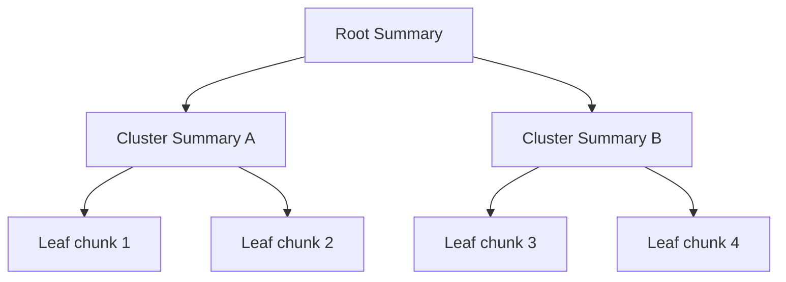

### Parent Document Retriever

Embed and index small, precise chunks (sentences) for high retrieval precision, but when a small chunk is matched, return its larger **parent chunk** (the full paragraph/section) to the LLM for generation — precision at search time, sufficient context at generation time.

### Auto-Merging Retrieval

When multiple retrieved leaf nodes share the same parent, merge them into one contiguous block instead of feeding the LLM several fragmented, overlapping snippets — reduces redundancy and preserves reading order.

### Code Example: Simplified RAPTOR Tree via Agglomerative Clustering

```python
# pip install scikit-learn numpy
import numpy as np
from sklearn.cluster import AgglomerativeClustering

def build_raptor_level(chunks: list[str], embeddings: np.ndarray, embed_fn, summarize_fn,
                        n_clusters: int) -> tuple[list[str], np.ndarray]:
    """One recursive level: cluster current nodes, summarize each cluster."""
    n_clusters = min(n_clusters, len(chunks))
    if n_clusters <= 1:
        # Base case: everything collapses into a single root summary
        root_summary = summarize_fn(chunks)
        return [root_summary], np.array([embed_fn(root_summary)])

    clustering = AgglomerativeClustering(n_clusters=n_clusters)
    labels = clustering.fit_predict(embeddings)

    next_level_texts, next_level_embeddings = [], []
    for cluster_id in range(n_clusters):
        cluster_chunks = [c for c, lbl in zip(chunks, labels) if lbl == cluster_id]
        summary = summarize_fn(cluster_chunks)  # <-- LLM call to summarize this cluster
        next_level_texts.append(summary)
        next_level_embeddings.append(embed_fn(summary))

    return next_level_texts, np.array(next_level_embeddings)

def build_raptor_tree(leaf_chunks: list[str], embed_fn, summarize_fn,
                       branching_factor: int = 4, max_levels: int = 4) -> dict:
    """Returns {level_index: (texts, embeddings)} for the whole tree, leaves at level 0."""
    tree = {}
    current_texts = leaf_chunks
    current_embeddings = np.array([embed_fn(c) for c in leaf_chunks])
    tree[0] = (current_texts, current_embeddings)

    level = 1
    while len(current_texts) > 1 and level < max_levels:
        n_clusters = max(1, len(current_texts) // branching_factor)
        current_texts, current_embeddings = build_raptor_level(
            current_texts, current_embeddings, embed_fn, summarize_fn, n_clusters
        )
        tree[level] = (current_texts, current_embeddings)
        level += 1

    return tree

def raptor_retrieve(tree: dict, query_embedding: np.ndarray, top_k: int = 3) -> list[str]:
    """Collapsed-tree retrieval: search ALL levels together, return best matches regardless of depth."""
    all_candidates = []
    for level, (texts, embeddings) in tree.items():
        sims = embeddings @ query_embedding / (
            np.linalg.norm(embeddings, axis=1) * np.linalg.norm(query_embedding) + 1e-8
        )
        for text, sim in zip(texts, sims):
            all_candidates.append((text, sim, level))
    all_candidates.sort(key=lambda x: x[1], reverse=True)
    return [text for text, sim, level in all_candidates[:top_k]]
```

*⚠️ Pitfall: Summarizing every cluster with a large LLM at build time is expensive and slow for big corpora — RAPTOR's ingestion cost is significantly higher than flat chunking. Budget for it explicitly; don't discover it in a production cost review.*

**When to use vs. avoid:** RAPTOR for long, hierarchically structured documents (books, long reports) where questions span both "big picture" and "fine detail." Parent Document Retriever as a cheaper, simpler middle ground for most enterprise docs. Avoid RAPTOR for small or rapidly-changing corpora — rebuilding the tree on every update is costly.

---

## Chapter 10: Reranking & Filtering `[Intermediate]`

### Cross-Encoders

**In plain English:** A bi-encoder embeds query and document *separately* (fast, approximate). A cross-encoder feeds the **concatenated** (query, document) pair through a transformer *together*, letting attention directly compare query tokens to document tokens — far more accurate, but too slow to run over an entire corpus. Standard pattern: bi-encoder retrieves top-100 candidates cheaply, cross-encoder reranks just those 100 for precision.

### MMR (Maximum Marginal Relevance)

Balances relevance against diversity: greedily pick the next document that maximizes `λ·sim(d, query) − (1−λ)·max_sim(d, already_selected)`. Prevents returning 5 near-duplicate chunks that all say the same thing.

### RAG-Fusion

Multi-query retrieval (Chapter 8) + RRF fusion (Chapter 7) + a final reranking/confidence filter — the "throw everything at it" advanced pattern for high-stakes retrieval quality.

### Code Example: Cross-Encoder Reranking

```python
# pip install sentence-transformers
from sentence_transformers import CrossEncoder

reranker = CrossEncoder("cross-encoder/ms-marco-MiniLM-L-6-v2")

def rerank(query: str, candidates: list[str], top_k: int = 5) -> list[str]:
    pairs = [[query, doc] for doc in candidates]        # <-- (query, doc) pairs, scored jointly
    scores = reranker.predict(pairs)                     # higher = more relevant
    ranked = sorted(zip(candidates, scores), key=lambda x: x[1], reverse=True)
    return [doc for doc, score in ranked[:top_k]]

# Full pipeline: cheap bi-encoder retrieves 100, expensive cross-encoder reranks to top 5
def retrieve_and_rerank(query: str, vector_retriever, top_k_retrieve: int = 100, top_k_final: int = 5):
    candidates = [d.page_content for d in vector_retriever.invoke(query, k=top_k_retrieve)]
    return rerank(query, candidates, top_k=top_k_final)
```

*⚠️ Pitfall: Running a cross-encoder over more than ~100-200 candidates per query destroys latency — it's O(n) transformer forward passes, not a single vectorized lookup like the bi-encoder stage. Always narrow with cheap retrieval first.*

---

## Chapter 11: Contextual Compression & Prompt Optimization `[Expert]`

### LLMLingua / Selective Context

Compresses retrieved context by removing low-information tokens (measured via a small LM's perplexity — tokens the model finds highly predictable carry little information and can often be dropped) before it hits the expensive generation-model prompt, fitting more *relevant* content into a fixed context budget.

### Document Re-packing

LLMs attend more reliably to content at the **start and end** of a long prompt than the middle (the "lost in the middle" effect). Re-pack retrieved documents so the most relevant ones sit at the beginning and end of the context block, with lower-relevance ones buried in the middle.

### Code Example: Perplexity-Based Compression (Simplified)

```python
# pip install transformers torch
import torch
from transformers import AutoModelForCausalLM, AutoTokenizer

class PerplexityCompressor:
    def __init__(self, model_name: str = "gpt2"):
        self.tokenizer = AutoTokenizer.from_pretrained(model_name)
        self.model = AutoModelForCausalLM.from_pretrained(model_name)
        self.model.eval()

    def _token_surprisal(self, text: str) -> list[tuple[str, float]]:
        # Surprisal (-log P(token | context)) approximates each token's information content
        input_ids = self.tokenizer.encode(text, return_tensors="pt")
        with torch.no_grad():
            logits = self.model(input_ids).logits
        log_probs = torch.log_softmax(logits, dim=-1)
        surprisals = []
        for i in range(1, input_ids.shape[1]):
            token_id = input_ids[0, i]
            surprisal = -log_probs[0, i - 1, token_id].item()
            token_str = self.tokenizer.decode([token_id])
            surprisals.append((token_str, surprisal))
        return surprisals

    def compress(self, text: str, target_ratio: float = 0.7) -> str:
        """Keep the highest-surprisal (most informative) tokens, drop the rest, ~target_ratio kept."""
        surprisals = self._token_surprisal(text)
        n_keep = max(1, int(len(surprisals) * target_ratio))
        # Keep top-N by information content, but restore original order for readability
        indexed = list(enumerate(surprisals))
        indexed.sort(key=lambda x: x[1][1], reverse=True)
        keep_indices = set(i for i, _ in indexed[:n_keep])
        kept_tokens = [tok for i, (tok, _) in enumerate(surprisals) if i in keep_indices]
        return "".join(kept_tokens)

def repack_by_relevance(docs_with_scores: list[tuple[str, float]]) -> str:
    """Highest-relevance docs go first AND last; lowest-relevance buried in the middle."""
    ranked = sorted(docs_with_scores, key=lambda x: x[1], reverse=True)
    front, back = [], []
    for i, (doc, score) in enumerate(ranked):
        (front if i % 2 == 0 else back).append(doc)
    return "\n\n".join(front + list(reversed(back)))
```

*⚠️ Pitfall: Aggressive token-level compression (below ~50% retention) frequently drops function words that carry grammatical/logical structure ("not", "except", "unless"), silently flipping the meaning of a compressed sentence. Validate compressed output against a faithfulness check (see Chapter 14's RAGAS Faithfulness metric) before trusting it in production.*

---

## Chapter 12: Generation & Synthesis Strategies `[Intermediate]`

| Strategy | Mechanism | Cost | Best For |
|---|---|---|---|
| Stuffing | All retrieved docs in one prompt | 1 LLM call | Small doc sets fitting in context |
| Map-Reduce | Summarize each doc, then summarize the summaries | N+1 calls | Large, independent doc sets |
| Refine | Iteratively update one running answer, one doc at a time | N calls (sequential) | When document order/context matters |
| Tree of Summaries | Hierarchical summarization (like RAPTOR's build phase) | O(N) calls, parallelizable per level | Massive corpora, multi-level questions |

### Code Example: "Refine" Strategy for a 100-Page PDF

```python
def refine_strategy(llm, question: str, document_chunks: list[str]) -> str:
    """Iteratively refine one running answer as each new chunk is read."""
    running_answer = None
    for i, chunk in enumerate(document_chunks):
        if running_answer is None:
            prompt = f"Context:\n{chunk}\n\nQuestion: {question}\nAnswer based only on this context:"
        else:
            # Each step can CONFIRM, EXTEND, or CORRECT the running answer using new context
            prompt = (
                f"Existing answer: {running_answer}\n\n"
                f"New context (part {i+1}):\n{chunk}\n\n"
                f"Question: {question}\n"
                f"Refine the existing answer using the new context. "
                f"If the new context doesn't add anything relevant, repeat the existing answer unchanged."
            )
        running_answer = llm.invoke(prompt).content
    return running_answer
```

*⚠️ Pitfall: Refine is inherently sequential — you cannot parallelize across chunks because each step depends on the previous answer, making it the slowest strategy wall-clock-wise for large document counts. Use Map-Reduce or Tree of Summaries when chunks are independent and latency matters.*

---

## Chapter 13: The "Big 3" Advanced RAG Architectures `[Expert]`

### CRAG (Corrective RAG)

**In plain English:** After retrieval, a lightweight evaluator LLM scores each retrieved document as `Correct`, `Ambiguous`, or `Incorrect` relative to the query. If the best document is `Incorrect`, CRAG doesn't just proceed with bad context — it triggers a **web search** or query reformulation as a fallback, and can also strip irrelevant sentences from `Ambiguous` documents before generation.

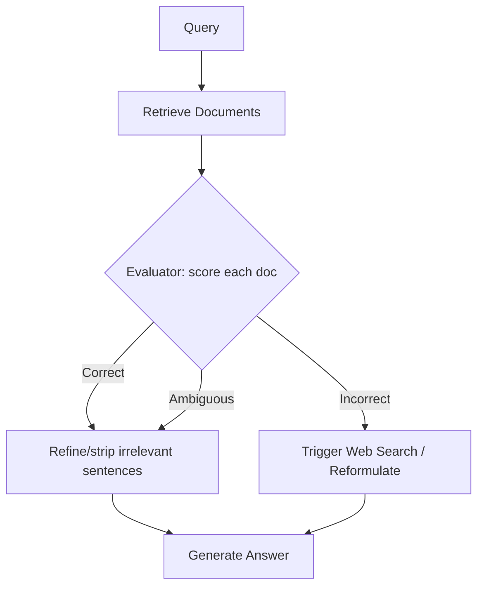

### Self-RAG

The generation model itself decides, token-by-token, whether it needs to retrieve (`Retrieve` reflection token), and after generating, emits reflection tokens (`ISREL`, `ISSUP`, `ISUSE`) that grade whether the retrieved passage was relevant, whether the generated statement is supported by it, and whether the response is useful overall — turning self-critique into part of the generation process rather than a separate evaluation pass.

### Adaptive RAG

A router classifies query complexity **before** choosing a retrieval strategy: no-retrieval for questions answerable from parametric knowledge, single-step RAG for simple factual lookups, multi-step/iterative RAG for complex multi-hop questions — avoiding the cost of heavy retrieval on queries that don't need it.

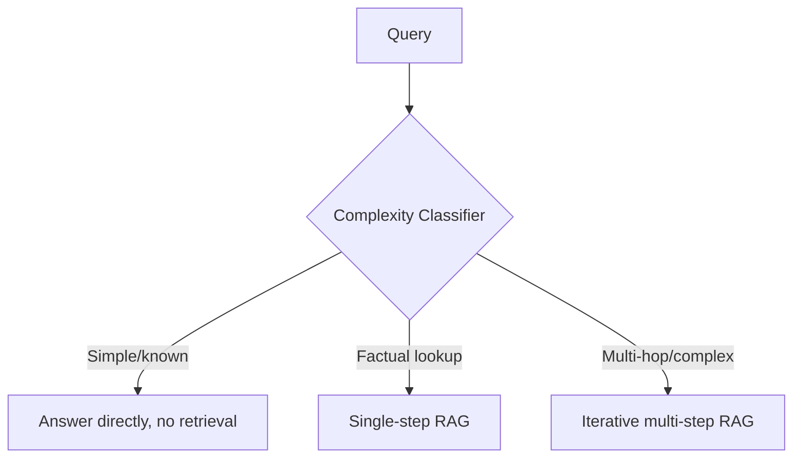

### Code Example: CRAG Evaluation Logic

```python
from enum import Enum

class RetrievalQuality(Enum):
    CORRECT = "correct"
    AMBIGUOUS = "ambiguous"
    INCORRECT = "incorrect"

def crag_evaluate(judge_llm, query: str, document: str) -> RetrievalQuality:
    prompt = (
        f"Query: {query}\nRetrieved document: {document}\n\n"
        f"Judge whether this document is relevant enough to answer the query.\n"
        f"Reply with exactly one word: CORRECT (directly answers it), "
        f"AMBIGUOUS (partially relevant), or INCORRECT (not relevant)."
    )
    verdict = judge_llm.invoke(prompt).content.strip().upper()
    return {
        "CORRECT": RetrievalQuality.CORRECT,
        "AMBIGUOUS": RetrievalQuality.AMBIGUOUS,
    }.get(verdict, RetrievalQuality.INCORRECT)  # default to incorrect if judge output is malformed

def strip_irrelevant_sentences(judge_llm, query: str, document: str) -> str:
    prompt = (
        f"Query: {query}\nDocument:\n{document}\n\n"
        f"Return ONLY the sentences from this document that are relevant to answering the query, "
        f"one per line, verbatim, with no commentary."
    )
    return judge_llm.invoke(prompt).content

def corrective_rag_pipeline(judge_llm, generation_llm, web_search_fn, retriever, query: str) -> str:
    retrieved_docs = [d.page_content for d in retriever.invoke(query)]

    evaluations = [(doc, crag_evaluate(judge_llm, query, doc)) for doc in retrieved_docs]
    best_doc, best_quality = max(
        evaluations,
        key=lambda x: {"correct": 2, "ambiguous": 1, "incorrect": 0}[x[1].value],
    )

    if best_quality == RetrievalQuality.INCORRECT:
        # Fallback: web search when local retrieval is judged untrustworthy
        context = web_search_fn(query)
    elif best_quality == RetrievalQuality.AMBIGUOUS:
        context = strip_irrelevant_sentences(judge_llm, query, best_doc)
    else:
        context = best_doc

    return generation_llm.invoke(f"Context:\n{context}\n\nQuestion: {query}").content
```

*⚠️ Pitfall: CRAG's evaluator LLM call runs on **every** retrieved document, per query — for a top-10 retrieval this is 10 extra LLM calls before generation even starts. Batch the evaluation calls or use a small, fast local classifier instead of a full LLM judge if latency is tight.*

**When to use vs. avoid:** CRAG when retrieval quality is inconsistent and a web fallback is available/acceptable. Self-RAG when you're training/fine-tuning your own model and can bake in reflection tokens (harder to bolt onto a closed API model). Adaptive RAG as the default cost-control layer in front of *any* of the above in production.

---

## Chapter 14: Evaluation of RAG Systems `[Intermediate→Expert]`

### RAGAS Metrics

- **Faithfulness:** Break the generated answer into individual claims, check each claim against the retrieved context for support — the fraction of claims that are grounded is the faithfulness score. Catches hallucination even when the *overall* answer sounds plausible.
- **Answer Relevancy:** Generate several hypothetical questions the answer *would* be a good response to, embed them, and compare their similarity to the original question — a relevant answer's implied questions should closely match what was actually asked.
- **Context Recall:** Checks whether every claim in the *ground-truth* answer can be attributed to the retrieved context — measures whether retrieval fetched enough of the right material.
- **Context Precision:** Checks whether the *relevant* chunks are ranked above irrelevant ones in the retrieved set — measures retrieval ranking quality, not just presence/absence.

### ARES

Trains a lightweight classifier on LLM-generated synthetic query/relevance-judgment pairs to score retrieval and generation quality cheaply at scale, without an LLM-judge call on every single evaluation example.

### E2E Metrics

RAG component metrics (above) tell you if retrieval/generation individually work. **End-to-end** metrics — did the *entire agent* (including any tool use, multi-turn clarification, and final action) succeed at the user's actual goal — are what production teams should gate releases on.

### Code Example: RAGAS Evaluation with HTML Report

```python
# pip install ragas datasets pandas
from ragas import evaluate
from ragas.metrics import faithfulness, answer_relevancy, context_recall, context_precision
from datasets import Dataset
import pandas as pd

eval_data = {
    "question": ["What checkpointer should I use in production?"],
    "answer": ["Use PostgresSaver or RedisSaver for production; MemorySaver is dev-only."],
    "contexts": [["SqliteSaver is for single-instance dev/prod. PostgresSaver supports horizontal scaling."]],
    "ground_truth": ["PostgresSaver or RedisSaver, for horizontal scaling in production."],
}
dataset = Dataset.from_dict(eval_data)

result = evaluate(
    dataset,
    metrics=[faithfulness, answer_relevancy, context_recall, context_precision],
)

df = result.to_pandas()

# Flag failures below threshold for a human-readable report
FAILURE_THRESHOLD = 0.7
failures = df[
    (df["faithfulness"] < FAILURE_THRESHOLD) | (df["context_precision"] < FAILURE_THRESHOLD)
]

html_report = f"""
<html><body>
<h1>RAGAS Evaluation Report</h1>
<h2>Summary</h2>
{df.mean(numeric_only=True).to_frame("mean_score").to_html()}
<h2>Failure Cases (score < {FAILURE_THRESHOLD})</h2>
{failures.to_html()}
</body></html>
"""
with open("ragas_report.html", "w") as f:
    f.write(html_report)
```

*⚠️ Pitfall: RAGAS's `context_recall` and Faithfulness metrics both require an LLM judge call per claim — running the full metric suite over a large eval set is expensive and slow. Sample a representative subset for frequent CI runs and reserve the full dataset for periodic deep evaluation.*

---

## Chapter 15: Production Scaling, Caching & Vector DB Optimization `[Expert]`

### Semantic Caching

Cache not just exact-match queries but **semantically similar** ones: embed the incoming query, check if a cached query embedding is within a similarity threshold, and if so, return the cached response instead of re-running retrieval + generation. Tools like `GPTCache` implement this pattern directly.

### Sharding Strategies

| Strategy | Description | Trade-off |
|---|---|---|
| Partitioning | Split the corpus across nodes by ID/hash range | Each query hits a subset — needs a scatter-gather query layer |
| Replication | Full index copied on every node | No scatter-gather needed, but write amplification and storage cost scale with replica count |
| Hybrid | Partition for scale + replicate each partition for availability | Standard production pattern (most managed vector DBs do this internally) |

### Async vs. Sync

Vector search, reranking, and generation are all independently I/O or GPU-bound — async pipelines let you overlap these across concurrent requests instead of blocking one request's generation call while another's retrieval is idle-waiting.

### Code Example: FastAPI RAG Endpoint with Async Retrieval + Redis Semantic Cache

```python
# pip install fastapi uvicorn redis numpy
import hashlib
import json
import numpy as np
from fastapi import FastAPI
from pydantic import BaseModel
import redis.asyncio as redis

app = FastAPI()
redis_client = redis.Redis(host="localhost", port=6379, decode_responses=True)

SIMILARITY_THRESHOLD = 0.95

class QueryRequest(BaseModel):
    question: str

async def embed_async(text: str) -> list[float]:
    # placeholder for a real async embedding call
    return list(np.random.rand(768))  # deterministic real impl would replace this

async def get_cached_response(query_embedding: list[float]) -> str | None:
    # Scan cached query embeddings for a semantically close match
    cached_keys = await redis_client.keys("cache:*")
    for key in cached_keys:
        cached = await redis_client.get(key)
        if not cached:
            continue
        entry = json.loads(cached)
        cached_emb = np.array(entry["embedding"])
        sim = np.dot(query_embedding, cached_emb) / (
            np.linalg.norm(query_embedding) * np.linalg.norm(cached_emb) + 1e-8
        )
        if sim >= SIMILARITY_THRESHOLD:
            return entry["response"]  # <-- semantic cache hit, skip retrieval + generation entirely
    return None

async def set_cache(query_embedding: list[float], response: str):
    key = f"cache:{hashlib.sha256(str(query_embedding).encode()).hexdigest()[:16]}"
    await redis_client.set(
        key, json.dumps({"embedding": query_embedding, "response": response}), ex=3600
    )

async def retrieve_async(query: str) -> list[str]:
    # placeholder for a real async vector DB client call (e.g., async pgvector/Milvus client)
    return [f"context chunk for: {query}"]

async def generate_async(query: str, context: list[str]) -> str:
    # placeholder for a real async LLM call
    return f"Answer to '{query}' using context: {context}"

@app.post("/rag")
async def rag_endpoint(req: QueryRequest):
    query_embedding = await embed_async(req.question)

    cached = await get_cached_response(query_embedding)
    if cached:
        return {"answer": cached, "cache_hit": True}

    context = await retrieve_async(req.question)
    answer = await generate_async(req.question, context)
    await set_cache(query_embedding, answer)

    return {"answer": answer, "cache_hit": False}
```

*⚠️ Pitfall: The `get_cached_response` implementation above scans every cached key, which is O(n) and will not scale past a small cache — production semantic caches use an actual vector index (even a small in-memory HNSW index, or the same vector DB as the main corpus) for the cache lookup itself, not a linear scan.*

---

## Appendix: Master Trade-off Quick Reference

| Decision | Choose A when... | Choose B when... |
|---|---|---|
| Fixed vs. Semantic Chunking | Corpus is huge, cost-sensitive | Retrieval precision is the priority |
| Dense-only vs. Hybrid Search | Data has no exact-match terms (SKUs, IDs) | Any exact-term matching matters |
| Flat Retrieval vs. RAPTOR | Corpus is small/flat/frequently updated | Corpus is long, hierarchical, stable |
| Stuffing vs. Refine | Docs fit in context, order doesn't matter | Docs exceed context, sequence matters |
| CRAG vs. Adaptive RAG | Retrieval quality is the main risk | Query complexity varies widely, cost control matters |
| Supervisor vs. Swarm | Task is decomposable, clear specialists | Open-ended, no natural hierarchy |
